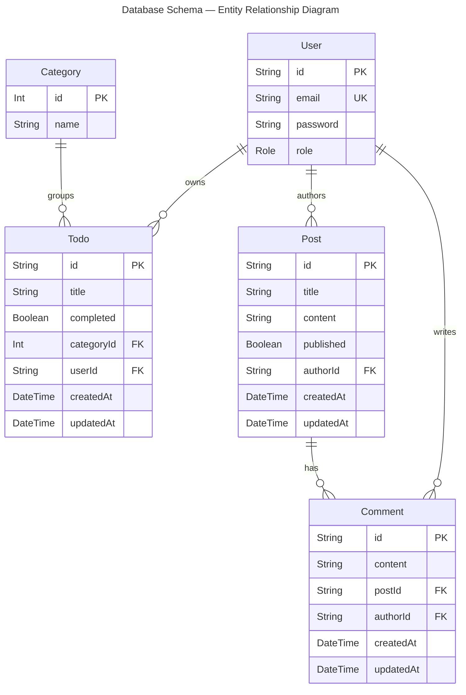

# Training Services API — Hono Framework

A REST + GraphQL API built with Hono, Prisma, and Bun. Covers authentication, RBAC, todos, posts, comments, and categories.

## Features

- **Authentication**: JWT-based with HttpOnly cookie fallback
- **RBAC**: `USER` / `ADMIN` roles encoded in JWT; enforced per-route
- **Database**: PostgreSQL with Prisma ORM and pg connection pool
- **Rate Limiting**: Three-tier rate limiting (auth, public, authenticated)
- **Logging**: Structured Pino logging with sensitive data redaction
- **REST API**: OpenAPI 3.0 with Scalar UI at `/doc`
- **GraphQL API**: Schema-first graphql-yoga endpoint at `/graphql`
- **Test Suite**: 82 tests (unit + integration) with Bun's built-in runner
- **Changelog**: Auto-updated `CHANGELOG.md` rendered at `/release`

## Tech Stack

- **Runtime**: Bun
- **Framework**: Hono
- **Database**: PostgreSQL (Prisma-hosted or self-hosted)
- **ORM**: Prisma
- **Authentication**: JWT
- **GraphQL**: graphql-yoga (schema-first)
- **Logging**: Pino with hono-pino
- **Rate Limiting**: hono-rate-limiter

## Getting Started

### Prerequisites

- Bun runtime installed
- PostgreSQL database (Prisma-hosted or self-hosted)

### Installation

```bash
bun install
```

### Environment Setup

Create a `.env` file:

```bash
DATABASE_URL=your_postgresql_connection_string
JWT_SECRET=your_secret_key
NODE_ENV=development
```

For running tests, create a `.env.test` file pointing to a separate test database:

```bash
DATABASE_URL=your_test_postgresql_connection_string
JWT_SECRET=your_secret_key
```

### Database Setup

Run Prisma migrations:

```bash
bunx prisma migrate dev
```

Seed the database:

```bash
bunx prisma db seed
```

## Development

Start the development server with hot-reload:

```bash
bun run dev
```

The API will be available at `http://localhost:3001`

## API Documentation

- **REST (Scalar UI)**: `http://localhost:3001/doc`
- **REST (OpenAPI spec)**: `http://localhost:3001/doc/openapi.json`
- **GraphQL (GraphiQL playground)**: `http://localhost:3001/graphql` — pass `Authorization: Bearer <token>` in the Headers panel
- **Changelog**: `http://localhost:3001/release` — themed markdown page (Light / Dark / Dracula / Slate)

## API Endpoints

### Authentication

- `POST /api/auth/signup` - Create new user account
- `POST /api/auth/login` - Login and receive JWT token (role encoded in JWT)

### Users

- `GET /api/users` - List all users (**admin only**)
- `GET /api/users/me` - Get current user profile (authenticated)
- `GET /api/users/{id}` - Get user by ID (**admin only**)

### Todos

- `GET /api/todos` - List user's todos with pagination (authenticated)
- `GET /api/todos?page={n}&limit={n}` - Paginated todos (default: page=1, limit=10, max limit=100)
- `GET /api/todos?categoryId={id}` - Filter todos by category (authenticated)
- `GET /api/todos/{id}` - Get todo by ID (authenticated)
- `POST /api/todos` - Create new todo (authenticated)
- `PUT /api/todos/{id}` - Update todo (authenticated)
- `DELETE /api/todos/{id}` - Delete todo (authenticated)

### Categories

- `GET /api/categories` - List all categories (public)
- `GET /api/categories?includeTodos=true` - Include todos in response (**admin only**)
- `GET /api/categories/{id}` - Get category by ID (public)
- `GET /api/categories/{id}?includeTodos=true` - Include todos in response (**admin only**)
- `POST /api/categories` - Create category (**admin only**)
- `PUT /api/categories/{id}` - Update category (**admin only**)
- `DELETE /api/categories/{id}` - Delete category, reassigns todos to default (**admin only**)

### Posts

- `GET /api/posts` - List posts with visibility rules (public: published only; owner: own drafts + published; admin: all)
- `GET /api/posts/{id}` - Get post by ID (same visibility rules)
- `POST /api/posts` - Create post (authenticated; defaults to draft)
- `PUT /api/posts/{id}` - Update post (owner or admin)
- `DELETE /api/posts/{id}` - Delete post (owner or admin)

### Comments

- `GET /api/posts/{postId}/comments` - List comments (post must be readable by requester)
- `POST /api/posts/{postId}/comments` - Add comment to a published post (authenticated)
- `DELETE /api/posts/{postId}/comments/{id}` - Delete comment (**admin only**)

## GraphQL API

Single endpoint at `POST /graphql` (also `GET /graphql` for GraphiQL). Auth is passed via `Authorization: Bearer <token>` header.

### Queries

```graphql
# Authenticated user profile
me: User

# Authenticated user's todos (mirrors REST pagination + category filter)
todos(categoryId: Int, page: Int, limit: Int): TodoPage!

# Single todo owned by the authenticated user
todo(id: String!): Todo

# Posts with visibility rules (same as REST)
posts(page: Int, limit: Int): PostPage!

# Single post (same visibility rules as REST)
post(id: String!): Post
```

### Mutations

```graphql
# Public
login(email: String!, password: String!): AuthPayload!
signup(email: String!, password: String!): AuthPayload!

# Authenticated
createTodo(title: String!, completed: Boolean, categoryId: Int): Todo!
updateTodo(id: String!, title: String, completed: Boolean, categoryId: Int): Todo!
deleteTodo(id: String!): DeleteResult!

createPost(title: String!, content: String!, published: Boolean): Post!
updatePost(id: String!, title: String, content: String, published: Boolean): Post!
deletePost(id: String!): DeleteResult!

createComment(postId: String!, content: String!): Comment!
deleteComment(postId: String!, id: String!): DeleteResult!
```

### Error handling

GraphQL always responds HTTP 200. Errors surface in the `errors[]` array with an `extensions.code` field:

| Code | Meaning |
|------|---------|
| `UNAUTHENTICATED` | Missing or invalid JWT |
| `FORBIDDEN` | Authenticated but not the resource owner |
| `NOT_FOUND` | Resource does not exist |
| `BAD_USER_INPUT` | Invalid credentials or duplicate email |

## Role-Based Access Control

The API supports two user roles encoded in the JWT token:

| Role | Description |
|------|-------------|
| `USER` | Default role assigned on signup |
| `ADMIN` | Set directly in the database; full API access |

**Access rules by resource:**

| Resource | Public | Authenticated (`USER`) | `ADMIN` |
|---|---|---|---|
| Categories (read) | ✓ | ✓ | ✓ |
| Categories (write) | — | — | ✓ |
| Todos | — | Own only | ✓ |
| Posts (published) | ✓ | ✓ | ✓ |
| Posts (draft) | — | Own only | ✓ |
| Post write/delete | — | Own only | ✓ |
| Comments (read) | On published posts | On readable posts | ✓ |
| Comments (create) | — | On published posts | ✓ |
| Comments (delete) | — | — | ✓ |
| Users (list/get) | — | — | ✓ |

## Database Schema



| Relationship | Cardinality | On Delete |
|---|---|---|
| `User` → `Todo` | one-to-many (userId optional) | Cascade |
| `User` → `Post` | one-to-many | Cascade |
| `User` → `Comment` | one-to-many | Cascade |
| `Category` → `Todo` | one-to-many | Cascade |
| `Post` → `Comment` | one-to-many | Cascade |

## Testing

The project uses Bun's built-in test runner with a real PostgreSQL test database.

```bash
bun test
```

Requires `.env.test` to be configured before running. The test suite automatically applies `.env.test` values and runs `prisma migrate deploy` against the test database before each file.

**Test structure:**

```
tests/
├── setup.ts                  # Preloaded: applies .env.test, runs migrations
├── helpers/
│   ├── app.ts                # Hono app instance for .request() calls
│   ├── auth.ts               # createUser(), createAdmin(), authHeader()
│   ├── db.ts                 # prisma export + truncateAndSeed()
│   └── factories.ts          # createTodo(), createPost(), createComment()
├── unit/
│   ├── auth.test.ts          # signToken, authMiddleware, optionalAuth
│   ├── access.test.ts        # canReadPost visibility logic
│   └── errors.test.ts        # AppError hierarchy
└── integration/
    ├── users.test.ts         # Signup, login, profile, admin list
    ├── todos.test.ts         # CRUD, pagination, ownership
    ├── posts.test.ts         # Visibility rules, RBAC
    ├── comments.test.ts      # Post-gated comments, admin delete
    └── categories.test.ts    # Public read, admin mutations, default-cat guard
```


## Rate Limiting

The API implements three-tier rate limiting:

- **Auth endpoints** (`/api/auth/*`): 100 requests per 15 minutes
- **Public endpoints** (`/api/categories*`): 500 requests per 15 minutes
- **Authenticated endpoints**: 1000 requests per 15 minutes per user

## Logging

Structured logging with environment-aware configuration:

- **Development**: Pretty-printed colored logs with full debug information
- **Production**: JSON-formatted logs optimized for aggregation tools (ELK, Datadog, CloudWatch)

Features:

- Request/response correlation with UUIDs
- Authentication event tracking
- Error logging with stack traces
- Slow request detection (>1000ms)
- Sensitive data redaction (passwords, tokens, cookies)

## Production Deployment

### Required Environment Variables

```bash
NODE_ENV=production
DATABASE_URL=your_postgresql_connection_string
JWT_SECRET=your_secret_key
```

### Optional Enhancements

- **Redis**: Configure Redis for distributed rate limiting
- **Log Aggregation**: Set up ELK Stack, Datadog, or CloudWatch
- **Monitoring**: Configure alerts for errors, slow requests, rate limit hits
- **Log Rotation**: Implement log rotation for file-based logging

See `RATE_LIMITING_AND_LOGGING_IMPLEMENTATION.md` for detailed production deployment guide.

## Documentation

- `CHANGELOG.md` — Version history; auto-updated by `version:*` scripts, rendered at `/release`

## Project Structure

```
.
├── prisma/
│   ├── schema.prisma          # Database schema
│   ├── seed.ts                # Database seeding (idempotent)
│   └── migrations/            # Migration history
├── scripts/
│   └── update-changelog.ts    # Auto-generates CHANGELOG.md entry from git log
├── tests/
│   ├── setup.ts               # Preload: force-applies .env.test, runs migrate deploy
│   ├── helpers/               # Shared test utilities (app, auth, db, factories)
│   ├── unit/                  # Pure function tests (no DB)
│   └── integration/           # HTTP-level route tests against real test DB
└── src/
    ├── index.ts               # App entry — middleware, router mounts, /graphql, /release
    ├── routers/               # REST route handlers (OpenAPI-first)
    │   ├── user.ts            # /api/auth/* and /api/users/*
    │   ├── todo.ts            # /api/todos/*
    │   ├── post.ts            # /api/posts/*
    │   ├── comment.ts         # /api/posts/:postId/comments/*
    │   └── category.ts        # /api/categories/*
    ├── graphql/               # GraphQL layer (graphql-yoga, schema-first)
    │   ├── schema.graphql     # SDL type definitions (source of truth)
    │   ├── context.ts         # JWT → userId extraction, requireAuth()
    │   ├── index.ts           # createYoga() instance
    │   └── resolvers/
    │       ├── Query.ts       # me, todos, todo, posts, post
    │       ├── Mutation.ts    # login, signup, CRUD for todos/posts/comments
    │       ├── Todo.ts        # Todo.category nested resolver
    │       ├── Post.ts        # Post.comments nested resolver
    │       ├── Comment.ts     # Comment.author nested resolver
    │       └── User.ts        # User.todos, User.posts nested resolvers
    ├── lib/                   # Shared utilities
    │   ├── auth.ts            # JWT sign/verify, authMiddleware, optionalAuth
    │   ├── access.ts          # canReadPost() — shared visibility logic for REST + GraphQL
    │   ├── errors.ts          # AppError hierarchy
    │   ├── index.ts           # Prisma client + extensions (user.signUp)
    │   ├── logger.ts          # Pino structured logging
    │   ├── message.ts         # Response formatting helpers
    │   ├── rate-limit.ts      # Three-tier rate limiter config
    │   └── release-page.ts    # HTML generator for /release
    ├── generated/             # Prisma-generated client (do not edit)
    ├── types/                 # Shared TypeScript types
    └── static/                # Served frontend assets
```

## License

This project is for educational purposes.
