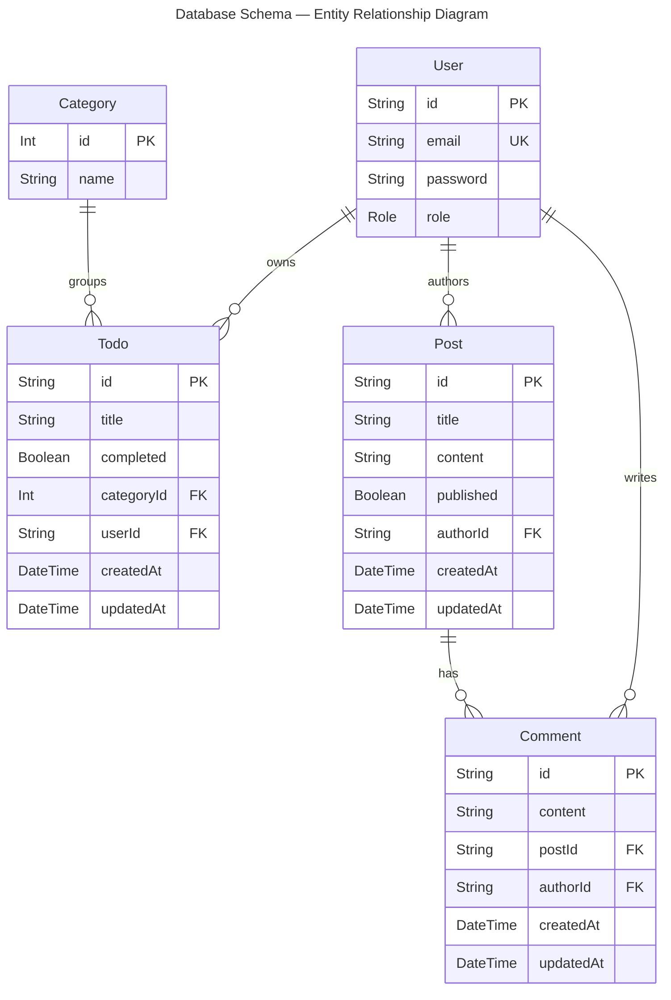

# Todo List API - Hono Framework

A production-ready Todo List API built with Hono framework, Prisma ORM, and PostgreSQL.

## Features

- **Authentication**: JWT-based authentication with HttpOnly cookies
- **Database**: PostgreSQL with Prisma ORM
- **Rate Limiting**: Three-tier rate limiting (auth, public, authenticated endpoints)
- **Logging**: Structured logging with Pino (development and production modes)
- **REST API**: OpenAPI/Swagger documentation via Scalar UI
- **GraphQL API**: Schema-first GraphQL endpoint with GraphiQL playground
- **Changelog**: `CHANGELOG.md` with auto-update on version bumps; rendered at `/release`
- **Security**: Input validation, sensitive data redaction, secure defaults

## Tech Stack

- **Runtime**: Bun
- **Framework**: Hono
- **Database**: PostgreSQL (Prisma-hosted or self-hosted)
- **ORM**: Prisma
- **Authentication**: JWT
- **GraphQL**: graphql-yoga (schema-first)
- **Logging**: Pino with hono-pino
- **Rate Limiting**: hono-rate-limiter

## Getting Started

### Prerequisites

- Bun runtime installed
- PostgreSQL database (Prisma-hosted or self-hosted)

### Installation

```bash
bun install
```

### Environment Setup

Create a `.env` file with the following variables:

```bash
DATABASE_URL=your_postgresql_connection_string
JWT_SECRET=your_secret_key
NODE_ENV=development
```

### Database Setup

Run Prisma migrations:

```bash
bunx prisma migrate dev
```

Seed the database:

```bash
bunx prisma db seed
```

## Development

Start the development server with hot-reload:

```bash
bun run dev
```

The API will be available at `http://localhost:3001`

## API Documentation

- **REST (Scalar UI)**: `http://localhost:3001/doc`
- **REST (OpenAPI spec)**: `http://localhost:3001/doc/openapi.json`
- **GraphQL (GraphiQL playground)**: `http://localhost:3001/graphql` — pass `Authorization: Bearer <token>` in the Headers panel
- **Changelog**: `http://localhost:3001/release` — themed markdown page (Light / Dark / Dracula / Slate)

## API Endpoints

### Authentication

- `POST /api/auth/signup` - Create new user account
- `POST /api/auth/login` - Login and receive JWT token (role encoded in JWT)

### Users

- `GET /api/users` - List all users (**admin only**)
- `GET /api/users/me` - Get current user profile (authenticated)
- `GET /api/users/{id}` - Get user by ID (**admin only**)

### Todos

- `GET /api/todos` - List user's todos with pagination (authenticated)
- `GET /api/todos?page={n}&limit={n}` - Paginated todos (default: page=1, limit=10, max limit=100)
- `GET /api/todos?categoryId={id}` - Filter todos by category (authenticated)
- `GET /api/todos/{id}` - Get todo by ID (authenticated)
- `POST /api/todos` - Create new todo (authenticated)
- `PUT /api/todos/{id}` - Update todo (authenticated)
- `DELETE /api/todos/{id}` - Delete todo (authenticated)

### Categories

- `GET /api/categories` - List all categories (public)
- `GET /api/categories?includeTodos=true` - Include todos in response (**admin only**)
- `GET /api/categories/{id}` - Get category by ID (public)
- `GET /api/categories/{id}?includeTodos=true` - Include todos in response (**admin only**)

## GraphQL API

Single endpoint at `POST /graphql` (also `GET /graphql` for GraphiQL). Auth is passed via `Authorization: Bearer <token>` header.

### Queries

```graphql
# Authenticated user profile
me: User

# Authenticated user's todos (mirrors REST pagination + category filter)
todos(categoryId: Int, page: Int, limit: Int): TodoPage!

# Single todo owned by the authenticated user
todo(id: String!): Todo
```

### Mutations

```graphql
# Public — returns token immediately
login(email: String!, password: String!): AuthPayload!
signup(email: String!, password: String!): AuthPayload!

# Authenticated
createTodo(title: String!, completed: Boolean, categoryId: Int): Todo!
updateTodo(id: String!, title: String, completed: Boolean, categoryId: Int): Todo!
deleteTodo(id: String!): DeleteResult!
```

### Error handling

GraphQL always responds HTTP 200. Errors surface in the `errors[]` array with an `extensions.code` field:

| Code | Meaning |
|------|---------|
| `UNAUTHENTICATED` | Missing or invalid JWT |
| `FORBIDDEN` | Authenticated but not the resource owner |
| `NOT_FOUND` | Resource does not exist |
| `BAD_USER_INPUT` | Invalid credentials or duplicate email |

## Role-Based Access Control

The API supports two user roles encoded in the JWT token:

| Role | Description |
|------|-------------|
| `USER` | Default role assigned on signup |
| `ADMIN` | Hardcoded in the database; full API access |

**Admin-only endpoints** return `403 Forbidden` for regular users:
- `GET /api/users`
- `GET /api/users/{id}`
- `GET /api/categories?includeTodos=true`
- `GET /api/categories/{id}?includeTodos=true`

## Database Schema



| Relationship | Cardinality | On Delete |
|---|---|---|
| `User` → `Todo` | one-to-many (userId optional) | Cascade |
| `User` → `Post` | one-to-many | Cascade |
| `User` → `Comment` | one-to-many | Cascade |
| `Category` → `Todo` | one-to-many | Cascade |
| `Post` → `Comment` | one-to-many | Cascade |

## Rate Limiting

The API implements three-tier rate limiting:

- **Auth endpoints** (`/api/auth/*`): 100 requests per 15 minutes
- **Public endpoints** (`/api/categories*`): 500 requests per 15 minutes
- **Authenticated endpoints**: 1000 requests per 15 minutes per user

## Logging

Structured logging with environment-aware configuration:

- **Development**: Pretty-printed colored logs with full debug information
- **Production**: JSON-formatted logs optimized for aggregation tools (ELK, Datadog, CloudWatch)

Features:

- Request/response correlation with UUIDs
- Authentication event tracking
- Error logging with stack traces
- Slow request detection (>1000ms)
- Sensitive data redaction (passwords, tokens, cookies)

## Production Deployment

### Required Environment Variables

```bash
NODE_ENV=production
DATABASE_URL=your_postgresql_connection_string
JWT_SECRET=your_secret_key
```

### Optional Enhancements

- **Redis**: Configure Redis for distributed rate limiting
- **Log Aggregation**: Set up ELK Stack, Datadog, or CloudWatch
- **Monitoring**: Configure alerts for errors, slow requests, rate limit hits
- **Log Rotation**: Implement log rotation for file-based logging

See `RATE_LIMITING_AND_LOGGING_IMPLEMENTATION.md` for detailed production deployment guide.

## Documentation

- `CHANGELOG.md` - Version history and release notes (auto-updated by `version:*` scripts)
- `MIGRATION_FINAL_REPORT.md` - PostgreSQL migration completion report
- `RATE_LIMITING_AND_LOGGING_IMPLEMENTATION.md` - Rate limiting and logging implementation guide
- `AUTH_IMPLEMENTATION.md` - Authentication system documentation

## Project Structure

```
.
├── prisma/
│   ├── schema.prisma          # Database schema
│   ├── seed.ts                # Database seeding
│   └── migrations/            # Migration history
├── scripts/
│   └── update-changelog.ts    # Auto-generates CHANGELOG.md entry from git log
└── src/
    ├── index.ts               # App entry — middleware, router mounts, /graphql, /release
    ├── routers/               # REST route handlers (OpenAPI-first)
    │   ├── category.ts
    │   ├── todo.ts
    │   └── user.ts
    ├── graphql/               # GraphQL layer (graphql-yoga, schema-first)
    │   ├── schema.graphql     # SDL type definitions
    │   ├── context.ts         # JWT → userId extraction, requireAuth()
    │   ├── index.ts           # createYoga() instance
    │   └── resolvers/
    │       ├── Query.ts       # me, todos, todo
    │       ├── Mutation.ts    # login, signup, createTodo, updateTodo, deleteTodo
    │       ├── Todo.ts        # Todo.category nested resolver
    │       └── User.ts        # User.todos nested resolver
    ├── lib/                   # Shared utilities
    │   ├── auth.ts            # JWT sign/verify, authMiddleware, optionalAuth
    │   ├── errors.ts          # AppError hierarchy
    │   ├── index.ts           # Prisma client + extensions
    │   ├── logger.ts          # Pino structured logging
    │   ├── message.ts         # Response formatting helpers
    │   ├── openapi.ts         # OpenAPI shared components
    │   ├── rate-limit.ts      # Three-tier rate limiter config
    │   └── release-page.ts    # HTML generator for /release (markdown + theme selector)
    ├── generated/             # Prisma-generated client (do not edit)
    ├── types/                 # Shared TypeScript types
    └── static/                # Served frontend assets
```

## License

This project is for educational purposes.
